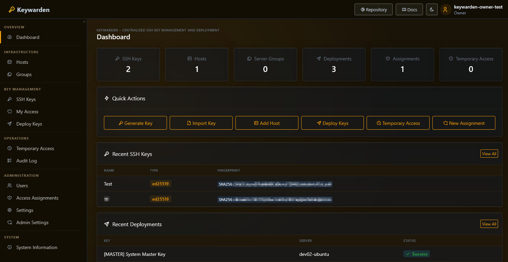

# Keywarden

**Keywarden** is a self-hosted web application for centralized SSH key management and deployment. It lets you generate, store, and deploy SSH keys to Linux servers from a single web interface — with full audit logging, role-based access control, and automated temporary access scheduling.





## ⚠️ Alpha Software — Important Notice

> **Keywarden is currently in alpha status.**
>
> - **Do NOT expose this application directly to the public internet.** Use it only in trusted, private networks.
> - The software may contain bugs, incomplete features, or security issues.
> - **Your feedback is valuable!** If you discover bugs or have suggestions, please open an [Issue on GitHub](https://github.com/pscriptos/keywarden/issues). Every report helps improve the project.

---

## Features

- **SSH Key Management** — Generate (RSA 2048/4096, Ed25519, Ed448) or import existing keys
- **Encrypted Storage** — Private keys encrypted at rest with AES-256-GCM
- **Server & Group Management** — Register servers, organize into groups
- **Access Assignments** — Declarative access model: assign users + keys to servers with system user, sudo, and user creation
- **Temporary Access** — Schedule time-limited access with automatic expiry (key removal, user disable, or user deletion)
- **Three-Tier Roles** — Owner, Admin, and User with distinct permissions
- **User Invitations** — Invite users via secure email links
- **Key Enforcement** — Bastillion-style enforced key management: automatically detect and remove unauthorized SSH keys from servers
- **Two-Factor Authentication** — TOTP-based MFA, optionally enforced for all users
- **Password Policies & Account Lockout** — Configurable complexity rules and brute-force protection
- **Audit Log** — Every action tracked with user, IP, timestamp, and details
- **Update Notifications** — Automatic update check with version badge in the header for admins
- **Encrypted Backup/Restore** — Full database export with password-based encryption
- **Docker-Native** — Single container with embedded SQLite, no external database required

---

## Quick Start

### Prerequisites

- [Docker](https://docs.docker.com/get-docker/) and [Docker Compose](https://docs.docker.com/compose/install/)

### 1. Clone and configure

```bash
git clone https://git.techniverse.net/scriptos/keywarden.git
cd keywarden
```

Create a `.env` file and generate two separate cryptographically secure keys:

```bash
# Generate keys (run twice, once per key):
openssl rand -base64 48
```

```env
KEYWARDEN_SESSION_KEY=<first generated string>
KEYWARDEN_ENCRYPTION_KEY=<second generated string>
```

> **Important:** Change both keys to unique random strings. The encryption key protects all stored SSH private keys — if lost, they cannot be recovered. See the [Quick Start Guide](docs/quickstart.md) for more options to generate secure keys.

### 2. Start

```bash
docker compose up -d
```

### 3. Get the initial password

```bash
docker compose logs keywarden
```

Look for the auto-generated admin password in the output:

```
════════════════════════════════════════════════════════════
  Initial owner account created
  Username: admin
  Password: <auto-generated>
  Please change this password after first login!
════════════════════════════════════════════════════════════
```

### 4. Open

Navigate to `http://your-host:8080` and log in. You will be prompted to change the password.

### 5. Deploy the master key

After login, copy the **system master key** (shown in Admin Settings and in the startup logs) and add it to the `authorized_keys` of the root user on every server you want to manage:

```bash
echo "ssh-ed25519 AAAA... keywarden-system-master" >> /root/.ssh/authorized_keys
```

---

## Documentation

For detailed documentation, see the [docs/](docs/README.md) folder:

- [Quick Start Guide](docs/quickstart.md)
- [Installation & Deployment](docs/deployment.md) — Docker, reverse proxy, HTTPS
- [Architecture](docs/architecture.md) — System design and components
- [User Guide](docs/user-guide.md) — SSH keys, settings, MFA
- [Admin Guide](docs/admin-guide.md) — Servers, deployments, access assignments, cron jobs
- [Roles & Permissions](docs/roles.md) — Owner, Admin, User role details
- [Security](docs/security.md) — Encryption, authentication, hardening
- [Environment Variables](docs/environment-variables.md) — Full configuration reference
- [Email Configuration](docs/email.md) — SMTP, notifications, invitations
- [Backup & Restore](docs/backup-restore.md) — Encrypted database backup
- [Troubleshooting](docs/troubleshooting.md) — Common issues and solutions
- [Contributing](docs/contributing.md) — Development setup and guidelines

---

## License

Keywarden is licensed under the [GNU Affero General Public License v3.0 (AGPL-3.0-or-later)](LICENSE).

© 2026 Patrick Asmus ([scriptos](https://git.techniverse.net/scriptos))

---

## Community

Join the **Keywarden Matrix chat** to discuss the project, ask questions, or share feedback:

[](https://matrix.to/#/#keywarden:techniverse.net)

➡️ [#keywarden:techniverse.net](https://matrix.to/#/#keywarden:techniverse.net)

---

## Repository & Mirror

| | URL |
|---|---|
| **Primary (Gitea)** | [git.techniverse.net/scriptos/keywarden](https://git.techniverse.net/scriptos/keywarden) |
| **Mirror (GitHub)** | [github.com/pscriptos/keywarden](https://github.com/pscriptos/keywarden) |
| **Container Registry** | [git.techniverse.net/scriptos/-/packages/container/keywarden](https://git.techniverse.net/scriptos/-/packages/container/keywarden) |

The **primary repository** is hosted on Gitea. The GitHub repository is a read-only mirror.

**Bug reports & feature requests:** Please open an [Issue on GitHub](https://github.com/pscriptos/keywarden/issues) — registration on the Gitea instance is currently closed.